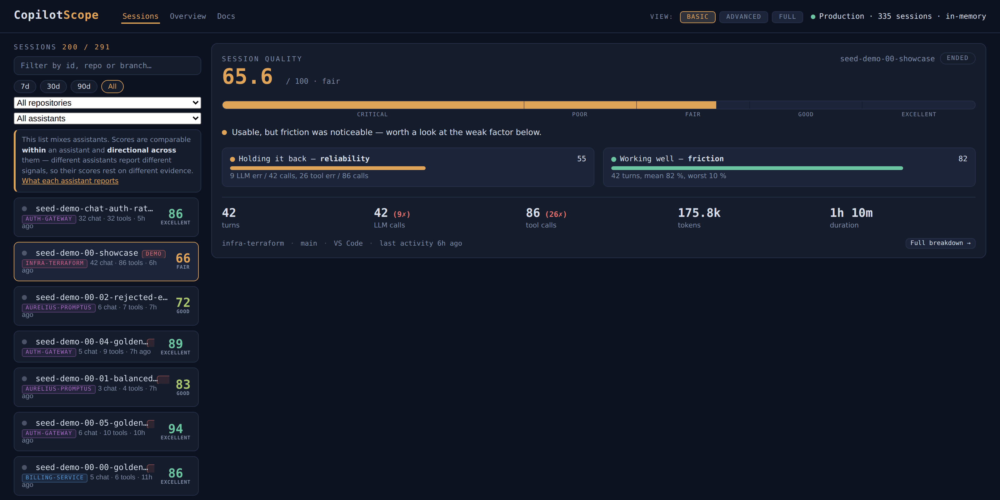
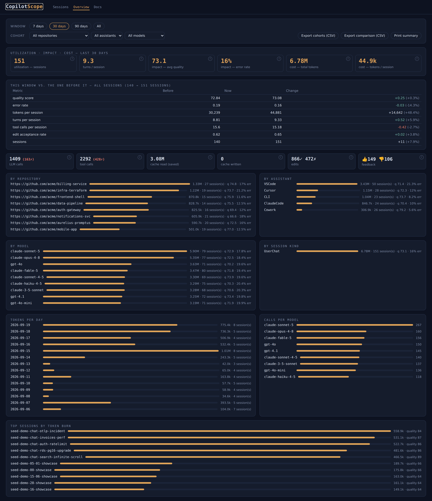
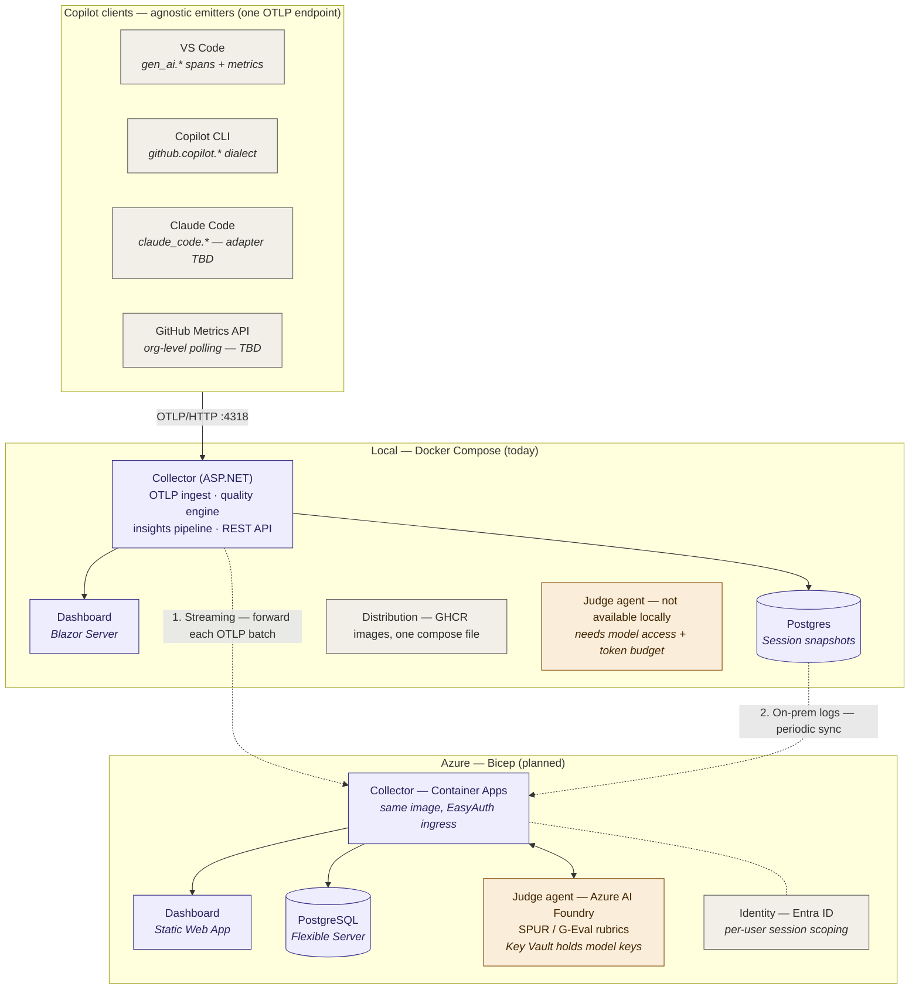

# CopilotScope

[](https://github.com/konradcinkusz/copilotscope/actions/workflows/build-containers.yml)
[](https://github.com/konradcinkusz/copilotscope/releases/latest/download/CopilotScope_Quality_Framework.pdf)
[](LICENSE)
[](https://github.com/konradcinkusz/copilotscope/releases/latest)
[](https://github.com/konradcinkusz/copilotscope/releases)
[](https://github.com/konradcinkusz/copilotscope/stargazers)
[](https://github.com/konradcinkusz/copilotscope/actions/workflows/ci.yml)
[](https://dotnet.microsoft.com/download/dotnet/8.0)

**Quality scoring for AI coding-assistant sessions.**

Your Copilot, Claude Code and Cursor already emit OpenTelemetry. Point them at
CopilotScope and you get more than a token counter: a composite quality score
per session, the turn where the conversation stalled, whether the accepted edits
actually survived, and what the repair loop cost. Runs on your machine; no SDK,
no account, no data leaving the box.

Everyone else counts **usage**. CopilotScope scores **quality** — and exports
that score to Prometheus and Grafana if you already run them.



```bash
curl -O https://raw.githubusercontent.com/konradcinkusz/copilotscope/master/docker-compose.ghcr.yml
docker compose -f docker-compose.ghcr.yml up
# dashboard on http://localhost:5200 · point your assistant at http://localhost:4318
```

No clone, no .NET, no login — the images are public on GHCR. Full walkthrough for
every assistant: **[docs/TUTORIAL.md](docs/TUTORIAL.md)**.

## What it measures that a usage dashboard doesn't

| Signal | Question it answers |
|---|---|
| Composite score 0–100 + confidence | Was this session any good — and is there enough telemetry to trust the number? |
| **TFRA** turn analysis | *Which turn* went wrong, and why: LLM/tool errors, latency vs this session's own median, repair loops |
| **Edit survival** | Did the accepted AI code stay in the file, or get reverted right after |
| Latency utility | How much of the session sat past the 2 s attention / 8 s abandonment thresholds |
| Token & cache economics | Cost per turn, cost per *accepted* edit, what the prompt cache actually saved |
| Frustration signals | Rephrasing, corrective replies and strong markers — report-only, never scored |

Five assistants land in the same schema: **VS Code Copilot, Copilot CLI, Claude
Code, Claude Cowork (the agent surface in the Claude desktop app) and Cursor**.
`Domain/Sem.cs` normalizes the Copilot-family dialects onto one namespace;
`Domain/ClaudeCode.cs` maps the Claude surfaces, which speak `claude_code.*`
metrics and log events rather than `gen_ai.*` spans.

Claude Code needs `CLAUDE_CODE_ENABLE_TELEMETRY=1` before anything at all is
exported — `scripts/Enable-ClaudeCodeOtel.ps1` / `.sh` set it and the rest.
Cowork is configured in the desktop app's own settings UI and wants the full
`/v1/logs` path. Both are walked through in
[docs/TUTORIAL.md](docs/TUTORIAL.md) §4.

## How *not* to use CopilotScope

This matters as much as the features, so it is not buried at the bottom:

- **Not for performance reviews.** The score grades a *session*, not a person.
  Ranking developers by it is a misuse the design does not support — there is no
  per-developer view, and adding one is not on the roadmap.
- **Acceptance rate is not a target.** Push on it and you reward accepting bad
  suggestions. That is exactly why acceptance is only 0.20 of the composite and
  is paired with *edit survival* — the counter-metric that catches code accepted
  and then reverted.
- **A single number is not a verdict.** Confidence is exported next to every
  score; a 90 built on four samples means less than a 70 built on forty. Read the
  components, not the headline.
- **Frustration analysis is report-only** and deliberately excluded from the
  composite. It is a lexical heuristic, and heuristics about human emotion do not
  belong in a number someone might act on.

The useful question is "where is our AI tooling wasting people's time", not "who
is the best developer". Goodhart's law applies to this repo too.

## Projects

| Project | Role | NuGet deps |
|---|---|---|
| `src/CopilotScope.AppHost` | Aspire orchestration: Postgres + pgAdmin containers, wiring | Aspire.Hosting.* 9.3 |
| `src/CopilotScope.Collector` | OTLP/HTTP ingest (in-repo protobuf decoder), session aggregation, quality scoring, turn analysis, REST API, Prometheus exporter, persistence | Npgsql only |
| `src/CopilotScope.Dashboard` | Blazor Server UI: sessions, quality VU-meter, turn analysis, prompt transcript, delete | **zero** |
| `tests/CopilotScope.Tests` | xUnit unit tests (decoder, routing, quality, turns, persistence roundtrip) | xunit |
| `tools/CopilotScope.TelemetryGen` | realistic demo telemetry generator (incl. gzip + captured content) | zero |
| `tools/CopilotScope.Seeder` | pushes a batch of comprehensive demo/local sessions into a running collector via `/api/admin/seed` | zero |
| `grafana/` | provisioned Prometheus scrape config, Grafana datasource and the CopilotScope dashboard JSON | — |
| `src/CopilotScope.AgentForge` | Opt-in agent grounded on consented session transcripts (Azure AI Foundry + Microsoft Agent Framework) — experimental, see [docs/AGENTFORGE.md](docs/AGENTFORGE.md) | Azure.AI.*, Microsoft.Agents.AI |
| `src/CopilotScope.JudgeAgent` | Opt-in, cloud-only session quality judge — G-Eval, SPUR, RAGAS, deep frustration classification, task-completion detection via Azure AI Foundry + Microsoft Agent Framework, see [docs/JUDGE_AGENT.md](docs/JUDGE_AGENT.md) | Azure.AI.*, Microsoft.Agents.AI |

## Quick start — no clone, just pull

Each GitHub release publishes two images to GHCR (see `.github/workflows/build-containers.yml`).
Users don't need the repository at all:

```bash
# Durable (Postgres + collector + dashboard) — download ONE file, no clone:
# Linux / macOS / Git Bash:
curl -O https://raw.githubusercontent.com/konradcinkusz/copilotscope/master/docker-compose.ghcr.yml
# Windows PowerShell:
curl.exe -O https://raw.githubusercontent.com/konradcinkusz/copilotscope/master/docker-compose.ghcr.yml
docker compose -f docker-compose.ghcr.yml up
```

Both images are public — no login, no token, no clone.

## Quick start — from source

Requirements: .NET 9 SDK + Docker. No workloads — Aspire 9 comes via NuGet.
(Everything targets `net8.0`; the 9.0 SDK is what builds the AppHost without
`dotnet workload install aspire`.)

```bash
dotnet run --project src/CopilotScope.AppHost
```

Aspire starts Postgres (named volume `copilotscope-pgdata`), **pgAdmin** (browse
the `sessions` table from the Aspire dashboard), the collector pinned to
`http://localhost:4318` and the dashboard. F5 on the AppHost project does the
same with the debugger attached to everything.

Then enable OTel in VS Code (full walkthrough for every Copilot surface,
including CLI and troubleshooting: **docs/TUTORIAL.md**):

```jsonc
{
  "github.copilot.chat.otel.enabled": true,
  "github.copilot.chat.otel.otlpEndpoint": "http://localhost:4318",
  "github.copilot.chat.otel.captureContent": true   // optional: prompt/response preview
}
```

Demo without Copilot — one realistic session played over real OTLP/HTTP (exercises the
actual ingest/decoder path):

```bash
dotnet run --project tools/CopilotScope.TelemetryGen -- http://localhost:4318 my-session
```

Seed a whole dataset instead — a handful of sessions for a fresh local run, or a big
varied set (different personas: clean, error-prone, laggy, rejected-edits, frustrated,
internal helper calls, ...) for a demo/presentation. Every profile also includes a
**showcase** session: a single 30+ turn chat engineered to light up every dashboard
panel at once — mixed clean/stalled/error/repair-loop turns, model switching, both
edit and feedback signals, multi-role captured content and scattered frustration.
On top of that, every profile seeds a set of **curated real conversations** —
hand-authored 30+ turn sessions that read like genuine developer chats (building a
Redis rate limiter, debugging a production OTLP incident on the CLI, shipping a React
search feature, an RDS Postgres major-version upgrade in Terraform, profiling a slow
SQL endpoint down from 3s to ~100ms) so the transcript view shows a coherent story,
not sample lines. Between them they cover every emitter — VS Code, Copilot CLI,
Claude Code and Cursor.
Pushes straight into a **running** collector via `POST /api/admin/seed`, no OTLP
encoding and no restart needed; always clears any previously seeded data first, so
re-running never piles up duplicates:

```bash
# quick: ~12 sessions (showcase + curated long chats), for local first-run sanity checks
dotnet run --project tools/CopilotScope.Seeder -- quick

# demo: a big multi-day dataset for presentations (default profile)
dotnet run --project tools/CopilotScope.Seeder -- demo http://localhost:4318 --days 14
```

Tests:

```bash
dotnet test
```

## Where the data lives

In **Postgres** (container managed by the AppHost, data on a named volume). Table
`sessions`: key `id` (= `gen_ai.conversation.id`), queryable columns
(`last_seen`, `quality_score`, `quality_grade`) plus the full session state as a
**jsonb snapshot** — counters, TTFT samples, tool stats, per-turn aggregates,
edits, feedback, the event tail and the captured transcript.

Write path: ingest marks sessions dirty, `PersistenceWriter` upserts them once
per second (telemetry bursts ≠ write storms). On startup the collector
**rehydrates** sessions from the database. A Postgres outage degrades to
in-memory and never blocks ingest.

`POST /api/admin/seed` takes the same route into a **running** collector:
`tools/CopilotScope.Seeder` builds full session snapshots and posts them there
directly, so seeding never needs a database connection of its own or a restart
to show up. Seeded rows are namespaced under the `seed-` id prefix, so a reset
(`{"reset": true}`, the seeder's default) only ever clears its own data.

**What about full chat content?** By default Copilot sends metadata only. With
`captureContent` enabled, prompt/response text arrives in span attributes and
CopilotScope stores it in the snapshot (bounded to the last 100 entries, each
truncated at 4 000 chars) — enough to review a session later, not a verbatim
archive. For a complete raw-telemetry archive, use the forwarder to a full
backend.

## Session quality

Two complementary views:

**Composite score 0–100** (`QualityEngine` v2): reliability 0.25 (squared
error-free rate) · acceptance 0.20 · **friction 0.20** (mean TFRA turn score) ·
latency 0.15 · feedback 0.10 · efficiency 0.10. Only components with actual
data enter the composite — weights are renormalized across them, so a session
without edit/feedback telemetry is scored on what it *did* produce instead of
being pinned near a neutral prior (the v1 behavior that made every session look
like an 80). Confidence = data coverage × sample ramp. Thresholds: ≥85
excellent, ≥70 good, ≥55 fair, ≥40 poor.

**Turn analysis (TFRA)** (`SegmentAnalyzer`): every `invoke_agent` trace is one
turn; each turn is scored for friction — LLM/tool errors, latency vs. *this
session's* median TTFT, repair loops (tool-call bursts with failures). The
dashboard highlights the best and worst turn **with reasons**.

### Evaluation algorithms — implementation status

Two axes now: **implementation status** (are the components there?) and **deployment scope** (does the algorithm work in the local-only setup, or does it require the cloud deployment with the judge agent?). Local means the analyzer runs entirely on-machine with no external services. Cloud means it depends on the Azure-provisioned judge agent (LLM access, model keys in Key Vault, per-user auth).

| # | Algorithm | Status | Local | Cloud | Where |
|---|---|---|---|---|---|
| 1 | LLM-as-a-Judge (G-Eval) | ✅ **implemented** (cloud, opt-in) | ❌ | ✅ | `CopilotScope.JudgeAgent` — `POST /api/sessions/{id}/judge`, see [docs/JUDGE_AGENT.md](docs/JUDGE_AGENT.md) |
| 2 | SPUR (learned satisfaction rubrics) | ✅ **implemented**, zero-shot (cloud, opt-in) | ❌ | ✅ | `CopilotScope.JudgeAgent` — directional until CopilotScope collects labelled SAT/DSAT sessions to calibrate against |
| 3 | RAG component metrics (RAGAS) | ✅ **implemented** (cloud, opt-in) | ❌ | ✅ | `CopilotScope.JudgeAgent` — only meaningful for retrieval-based Copilot flows; `no-data` until the Collector captures retrieval context |
| 4 | Edit Survival Analysis | ✅ **full** | ✅ | ✅ | `EditSurvivalAnalyzer` — four-gram & no-revert split (0.4/0.6); also feeds the *acceptance* component |
| 5 | Acceptance-weighted throughput | ✅ **full** | ✅ | ✅ | `ThroughputAnalyzer` — accepted LOC/turn, LOC per 1k output tokens, rejection-discounted |
| 6 | Turn-level Friction & Repair (TFRA) | ✅ **full** | ✅ | ✅ | `SegmentAnalyzer` (Turn analysis panel) + *friction* component in the composite |
| 7 | Latency-utility model | ✅ **full** | ✅ | ✅ | `LatencyUtilityAnalyzer` — per-sample utility curve, >2 s / >8 s risk buckets; simplified form also as the *latency* component |
| 8 | Token & cache economics | ✅ **full** | ✅ | ✅ | `TokenEconomicsAnalyzer` — per-model cost (`CopilotScope:Pricing`), cache savings, cost per turn / accepted edit |
| 9 | Frustration classification | ✅ **simplified** (local) · ✅ **deep** (cloud, opt-in) | ✅ heuristic | ✅ | Local: `FrustrationAnalyzer` — EN/PL lexicon + rephrasing (Jaccard) + typography, **report-only**. Cloud: `CopilotScope.JudgeAgent` deep classifier (sarcasm-aware, context-grounded), still report-only — promoting it into the composite is a separate future decision made by config |
| 10 | Task-completion detection | ⚠️ partial (local) · ✅ **implemented** (cloud, opt-in) | ⚠️ partial | ✅ | Local partial: no external completion-signal ingest path yet (build/test exit codes). Cloud: `CopilotScope.JudgeAgent` reasons about "did the user's ask get resolved" from transcript alone; `completionSignals` will be honored once the Collector gains that ingest path |

Analyzers #4–#9 (local column) run as a pluggable insight pipeline (`Quality/Insights.cs`): one `IInsightAnalyzer` class + one DI registration = a new algorithm, zero UI work. Cloud-only analyzers (#1–#3, plus the deep variants of #9/#10) implement the same `IInsightAnalyzer` interface but call out to the Azure AI Foundry judge agent; they register only when the collector is deployed with judge configuration enabled, so a local-only setup shows them as "no-data" with a `"requires cloud deployment"` note rather than an error. Full survey with design rationale: `docs/ANALYSIS.md` §8–8b (Polish).

Each of the ten is also written up as a **standalone thesis topic** — one A4 page
per topic with scope, methodology, acceptance criteria and a code entry point, split
between BSc- and MSc-level work: `research/articles/thesis_topics.tex` (Polish; the
`CopilotScope_Thesis_Topics.pdf` build is attached to every release). The numbering
matches the table above.

## Deployment options

| Mode | Command | Containers |
|---|---|---|
| Dev (Aspire) | `dotnet run --project src/CopilotScope.AppHost` | postgres, pgadmin |
| Compose | `docker compose up --build` | postgres, collector, dashboard |
| **GHCR (durable)** | see "Quick start — no clone, just pull" above | postgres, collector, dashboard |
| **With Grafana** | `docker compose -f docker-compose.grafana.yml up` | + prometheus, grafana |
| Azure Container Apps | `infra/main.bicep` | collector (+ your PG) |

In Production mode `/v1/*` requires `x-api-key` (`CopilotScope__Ingest__ApiKey`);
clients add it via `OTEL_EXPORTER_OTLP_HEADERS="x-api-key=<secret>"`.

## Collector API

| Endpoint | Description |
|---|---|
| `POST /v1/traces` `/v1/metrics` `/v1/logs` | OTLP/HTTP ingest (protobuf; gzip/deflate supported) |
| `GET /api/sessions` | session list with quality scores |
| `GET /api/sessions/{id}` | details: tools, errors, events, transcript, turn analysis |
| `GET /api/overview` | cross-session summary: total token burn, per-model calls, daily usage, top sessions |
| `DELETE /api/sessions/{id}` | remove a session (memory + Postgres) |
| `GET /api/health` | health incl. persistence status |
| `GET /metrics` | Prometheus scrape endpoint — see below |

## Prometheus & Grafana

Already running an observability stack? The collector exposes its **derived**
signals — not just raw usage — on `GET /metrics` in the Prometheus text format.
Plenty of exporters will tell you how many tokens you burned;
`copilotscope_quality_*` is the part nothing else exports.

```bash
docker compose -f docker-compose.grafana.yml up
# Grafana http://localhost:3000 — datasource and dashboard already provisioned
```


| Metric | What it carries |
|---|---|
| `copilotscope_quality_score_sum` / `_count` | composite score; divide for the mean over any label set |
| `copilotscope_quality_confidence_sum` | how much telemetry the score rests on |
| `copilotscope_quality_component_sum` / `_count` | `component=` reliability, acceptance, friction, latency, feedback, efficiency |
| `copilotscope_edit_survival_sum` / `_count` | did accepted edits stay in the file |
| `copilotscope_ttft_seconds` | `aggregate=` p50, p95 |
| `copilotscope_tokens_total`, `copilotscope_cost_usd_total` | `type=`, `model=` |
| `copilotscope_calls_total`, `copilotscope_call_errors_total` | `kind=` chat, tool |
| `copilotscope_edits_total`, `copilotscope_feedback_total` | `outcome=`, `vote=` |
| `copilotscope_sessions` | `grade=` excellent … critical |

Everything carries an `emitter` label (`vscode`, `cli`, `claude_code`, `cursor`),
so a regression in one assistant is visible instead of averaged away.

Scores are exported as `_sum`/`_count` pairs rather than pre-averaged gauges, so
PromQL keeps the arithmetic honest across any grouping:

```promql
sum by (emitter) (copilotscope_quality_score_sum)
  / sum by (emitter) (copilotscope_quality_score_count)
```

**Cardinality.** Aggregate series only, by default. Per-session series carry an
unbounded `session` label, so they are opt-in and capped — the most recent
sessions win and `copilotscope_session_series_dropped` reports the remainder:

```jsonc
"CopilotScope": {
  "Prometheus": {
    "Enabled": true,
    "PerSession": false,      // adds session= label; off by default
    "MaxSessionSeries": 200,
    "MaxErrorTypes": 30
  }
}
```

When `CopilotScope__Ingest__ApiKey` is set, `/metrics` requires it too (Prometheus
sends it as `authorization: Bearer`, see `grafana/prometheus.yml`) — with
per-session series enabled the endpoint exposes session ids, so it must not be
more open than the data it summarizes.

Note this is *not* the same feature as `CopilotScope__Forwarding__*`, which
relays raw OTLP to an upstream backend. Forwarding ships the telemetry;
`/metrics` ships the conclusions.

## Dashboard pages

- **Sessions** (`/`) — live session list, quality VU-meter, turn analysis with
  best/worst reasons, prompt transcript, delete control.
- **Overview** (`/overview`) — everything you burned across all chats: total
  input/output/cache tokens, tokens per day, calls per model, top sessions by
  token burn, average quality.

  

- **Docs** (`/docs`) — built-in deep documentation: what every tile and score
  component means, the rationale (and honest objections) behind each insight
  algorithm, content-capture semantics and known limitations.

## Copilot CLI in one command

```powershell
.\scripts\Enable-CopilotOtel.ps1                  # metadata only
.\scripts\Enable-CopilotOtel.ps1 -CaptureContent  # + prompt/response content
copilot                                           # run from the SAME terminal
```

```bash
source ./scripts/setup.sh --copilot-cli           # macOS / Linux: starts the stack too
copilot                                           # run from the SAME terminal
```

Heads-up: `COPILOT_OTEL_CAPTURE_CONTENT` is **not a real variable** — the CLI
follows the OTel GenAI standard `OTEL_INSTRUMENTATION_GENAI_CAPTURE_MESSAGE_CONTENT=true`,
which is what the script sets.

## Architecture

Copilot clients (VS Code, Copilot CLI, Claude Code, GitHub Metrics API) are
agnostic to the deployment — they emit OpenTelemetry to **one OTLP endpoint**,
which in the basic setup is the local collector. From there sessions can stay
on the developer's machine, be streamed upstream to Azure in near real time, or
be batch-synced from Postgres after the fact. The Azure deployment (Bicep,
planned) provisions the same collector image plus an LLM **judge agent** that
grades sessions using SPUR/G-Eval rubrics — a class of insights that requires
model access and is deliberately unavailable in the local-only setup.


<details>
<summary>Diagram source (Mermaid — edit here, re-export SVG)</summary>


</details>

## Design notes

- The OTLP protobuf decoder is written in-repo (field numbers verified against
  the official OpenTelemetry `.proto` files) — the collector doesn't pull the
  OTel SDK.
- The dashboard polls the collector API every 2 s (zero extra packages);
  swapping in the SignalR client is a one-class change if push is ever needed.
- Ingest accepts OTLP/HTTP protobuf only (Copilot's default); JSON gets a 415
  with a configuration hint. Compressed bodies are decompressed transparently.
- Architecture analysis with diagrams (in Polish): `docs/ANALYSIS.md`.
- Telemetry → persona-agent provisioning workflow, with diagram and the warehouse-worker/robot
  training analogy (in Polish): `docs/AGENT_PROVISIONING_WORKFLOW.md`.
- Ten research-paper proposals, one per evaluation algorithm above, for engineers picking up the
  next round of work: `research/RESEARCH_PROPOSALS.md`.

## License

MIT — see [LICENSE](LICENSE).
