# Diagrams

Every structural claim CopilotScope makes, as a picture — rendered by GitHub
itself, with no build step and no JavaScript.

These are the same diagrams the two LaTeX editions of the manual include. There
is one source for each: the `.mmd` files in [`docs/diagrams/`](diagrams/).
`scripts/render-diagrams.mjs` turns them into vector PDFs for the papers, and
`scripts/check-diagrams.mjs` fails the build if the copy embedded below ever
disagrees with the file.

## Each diagram exists twice, and a check keeps them equal

- **Inline here**, because that is the only form GitHub renders.
- **As a standalone `.mmd`**, because a paper cannot include a fenced code
  block, and because a diagram nobody can open on its own is a diagram nobody
  reuses — in a slide, an issue, or a review comment.

The pairing rule is the section id: `### A1.` owns `docs/diagrams/a1-*.mmd`. The
same check also holds the architecture diagram embedded in `README.md` to
`architecture.mmd`, a pair that was previously identical only by luck.

```bash
npm ci                      # once — the pinned mermaid CLI
npm run check:diagrams      # exactly what CI runs
npm run render:diagrams     # vector PDFs into docs/diagrams/rendered/
```

## How to read these

The series are ordered the way the manual is: **A** is what the system *is*,
**B** is how data gets into it, **C** is what it measures, **D** is how it runs.
One box is highlighted in each diagram — the thing that diagram is actually
about.

## A. Structure

### A1. System context — who emits, who collects

Four assistants, one port. Every supported surface speaks OpenTelemetry over
HTTP to the same endpoint, and the collector tells them apart from the payload
rather than from configuration. Cowork is the one that wants the full
`/v1/logs` path instead of the base endpoint; everything else takes `:4318`.
The GitHub Metrics API is the odd one out — the collector polls it, rather than
being pushed to, and what it returns is org-level usage, context beside the
score rather than the score itself.

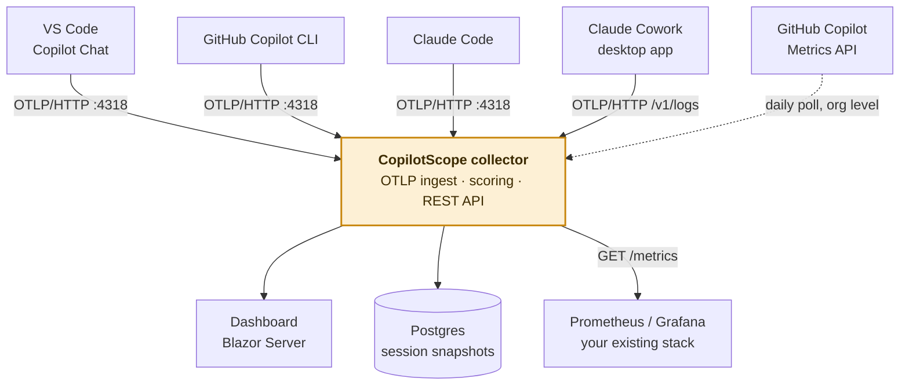

<sub>Source: [`docs/diagrams/a1-system-context.mmd`](diagrams/a1-system-context.mmd)</sub>

### A2. Solution layout — what each project is for

The collector is the product; everything else is either a view onto it, a
development convenience, or opt-in. `ServiceDefaults` is a thin shared kernel —
self-instrumentation, health endpoints, service discovery, HTTP resilience —
and carries no domain logic. The two agent services and the three tools all
reference the collector for its domain types, which is why a change to a DTO
is a change to five projects.

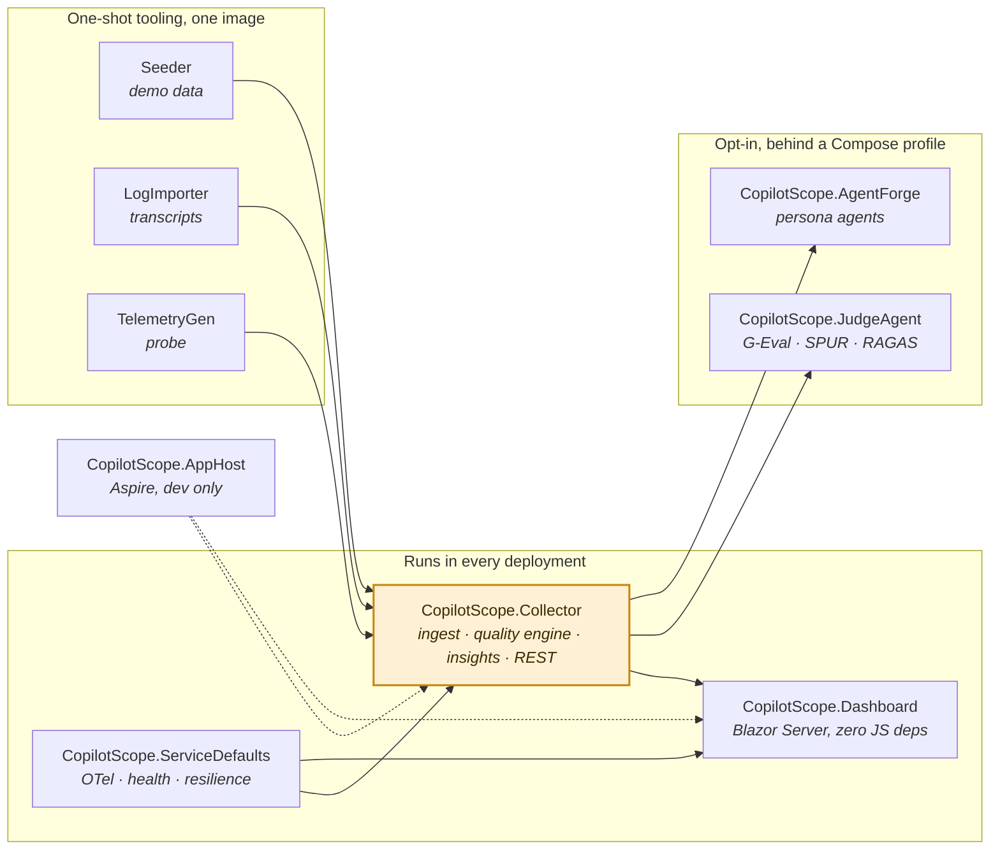

<sub>Source: [`docs/diagrams/a2-solution-layout.mmd`](diagrams/a2-solution-layout.mmd)</sub>

### A3. Ingest pipeline — what happens to one OTLP batch

Read this as the answer to "why is my dashboard empty". Every arrow that
leaves the happy path logs why. Two details matter more than they look:
redaction happens *before* anything aggregates, so privacy mode's guarantee
survives a database dump rather than depending on every read path; and the
decoded payload is bounded, because gzip reaches roughly 1000:1 and an
unbounded copy of a compressed body is a memory-exhaustion vector reachable
before authentication when no key is set.

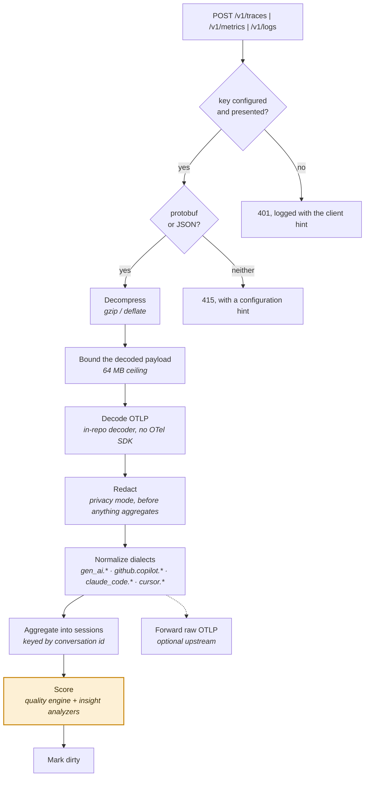

<sub>Source: [`docs/diagrams/a3-ingest-pipeline.mmd`](diagrams/a3-ingest-pipeline.mmd)</sub>

### A4. Session lifecycle — memory, Postgres, and eviction

The in-memory store is a bounded working set of the most recently active
sessions, not the extent of your history: a team churns past that cap in hours.
Eviction is therefore not deletion. Late telemetry for an evicted session
merges the stored snapshot back in before the next flush rather than
overwriting it, which is the difference between a session that grows and a
session that silently restarts.

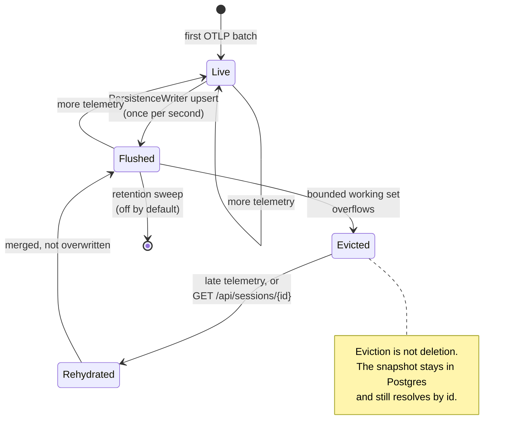

<sub>Source: [`docs/diagrams/a4-session-lifecycle.mmd`](diagrams/a4-session-lifecycle.mmd)</sub>

## B. Getting data in

### B1. Install and connect — the path to a first scored session

The whole install is two commands and one manual step per assistant that no
script can take. `connect` is the interesting box: it writes the settings file
the assistant itself reads, rather than exporting variables that live in one
terminal. `doctor` exists because the failure mode here is silent — a correctly
started stack and a correctly started assistant that never talk to each other
look exactly like a working install with nothing to show yet.

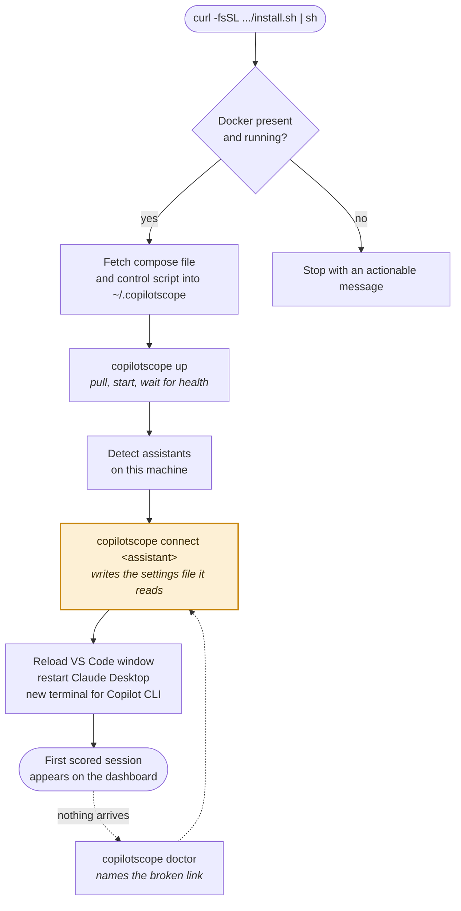

<sub>Source: [`docs/diagrams/b1-install-and-connect.mmd`](diagrams/b1-install-and-connect.mmd)</sub>

### B2. Where each assistant's switch actually lives

This is the diagram that explains why setup used to be fiddly. The four
surfaces keep their configuration in three different kinds of place, and only
one of those places survives opening a new terminal. Claude Code is the best
case: an `env` block in its settings file applies to every terminal and every
project. Copilot CLI is the worst: environment variables are the only thing it
reads, so the configuration is as durable as the shell you set it in.

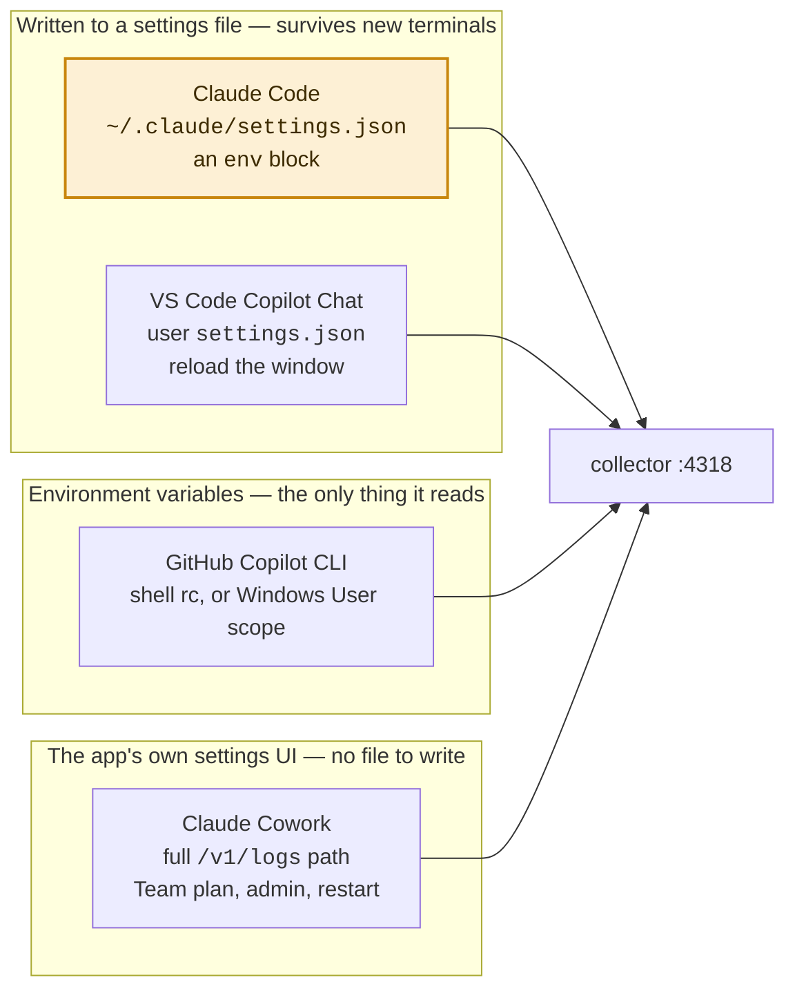

<sub>Source: [`docs/diagrams/b2-where-each-switch-lives.mmd`](diagrams/b2-where-each-switch-lives.mmd)</sub>

### B3. Import — scoring the history that already exists

Claude Code records every session to disk whether or not telemetry is
configured, and most developers never configure it. This path needs no client
setup at all. Two refusals in it are deliberate: a repository label is left
absent rather than guessed from a directory name, because a guess would invent
a second cohort for a project the collector already knows; and a session
already held from live telemetry is not overwritten, because the import
carries less signal and would quietly lower its score.

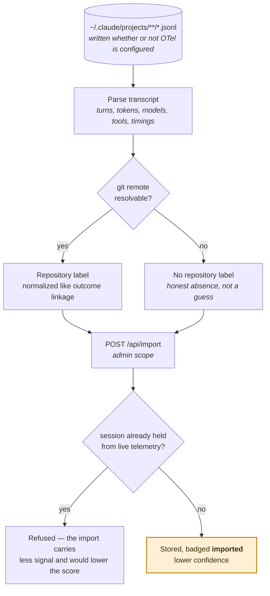

<sub>Source: [`docs/diagrams/b3-transcript-import.mmd`](diagrams/b3-transcript-import.mmd)</sub>

## C. The measurement

### C1. The composite score — six components, renormalized

The weights are published and the arithmetic is re-derivable by hand. The part
worth understanding is the renormalization: only components that actually have
data enter the composite. An earlier version let empty components contribute a
neutral prior, which made every session look like an 80. Confidence is exported
next to every score for the same reason — a 90 built on four samples means less
than a 70 built on forty.

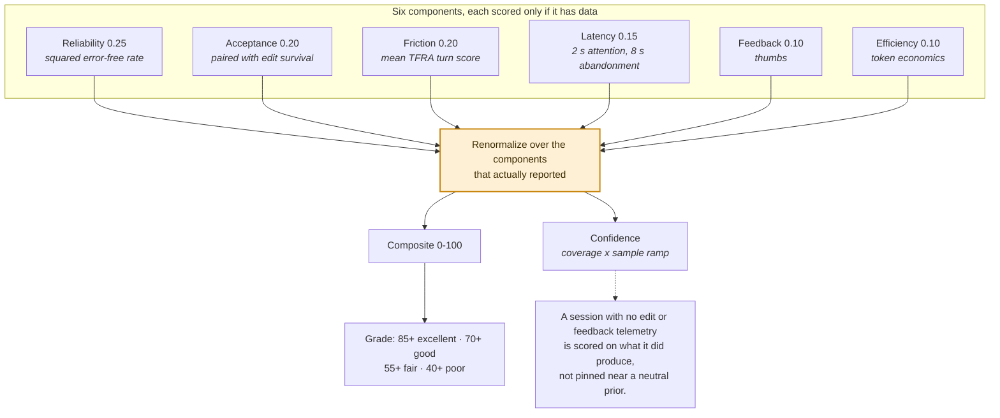

<sub>Source: [`docs/diagrams/c1-composite-score.mmd`](diagrams/c1-composite-score.mmd)</sub>

### C2. Turn analysis — where the conversation actually went wrong

A composite score says a session was poor. This says which turn, and why. Every
`invoke_agent` trace is one turn, scored for errors, latency against *this
session's own* median, and repair loops. The per-session median is the
load-bearing choice: it separates a slow turn from a slow model, which a global
threshold cannot do.

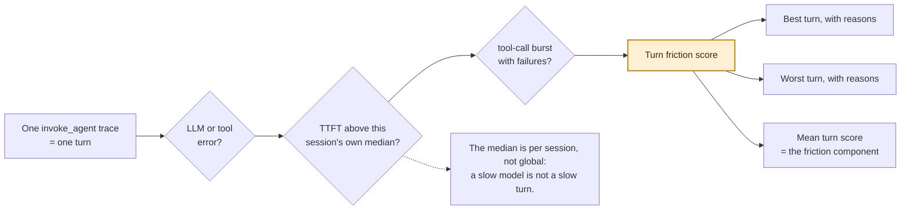

<sub>Source: [`docs/diagrams/c2-turn-analysis.mmd`](diagrams/c2-turn-analysis.mmd)</sub>

### C3. Signal coverage — why scores compare within, not across

Every assistant lands in the same schema, and they do not report the same
signals. A Claude Code session has no thumbs feedback and no edit-survival
signal, so its 80 rests on less evidence than a VS Code session's 80. The
composite handles this honestly by renormalizing, and the confidence figure
reports what it had to work with. What it cannot do is make the two numbers
mean the same thing.

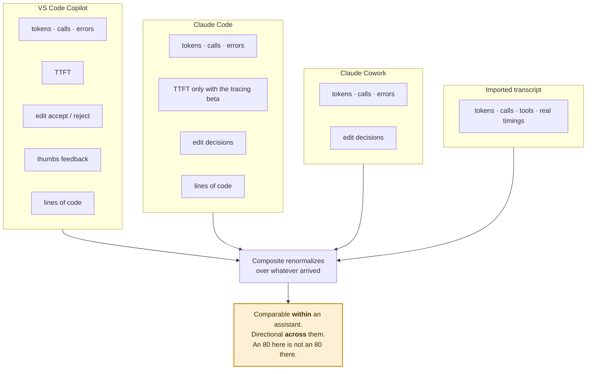

<sub>Source: [`docs/diagrams/c3-signal-coverage.mmd`](diagrams/c3-signal-coverage.mmd)</sub>

## D. Running it

### D1. Deployment modes — and the one combination that is refused

The zero-credential default is not laxity; it is scoped. On loopback, with no
published database port, a key protects nothing and costs a configuration step
in every client — and that step is the one people get wrong. Publishing beyond
loopback is a different deployment, so the installer and the control script
refuse to do it without a key in the same command, and the collector says so
at startup if it finds itself exposed anyway.

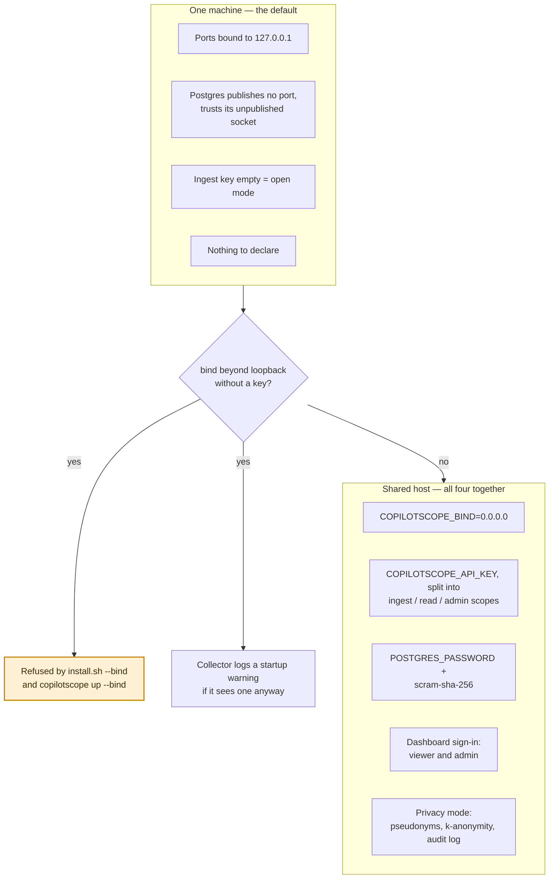

<sub>Source: [`docs/diagrams/d1-deployment-modes.mmd`](diagrams/d1-deployment-modes.mmd)</sub>

### D2. CI gates — what blocks a merge, and what a tag releases

For most of this repository's life the images were built only when a release
tag was pushed, so a broken Dockerfile produced a partially-published release
rather than a red pull request. All five images are now built and started on
every pull request, which found two bugs that had made every image unbuildable
in its first run.

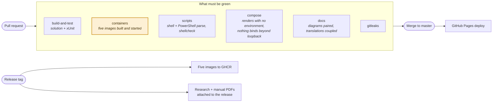

<sub>Source: [`docs/diagrams/d2-ci-gates.mmd`](diagrams/d2-ci-gates.mmd)</sub>

