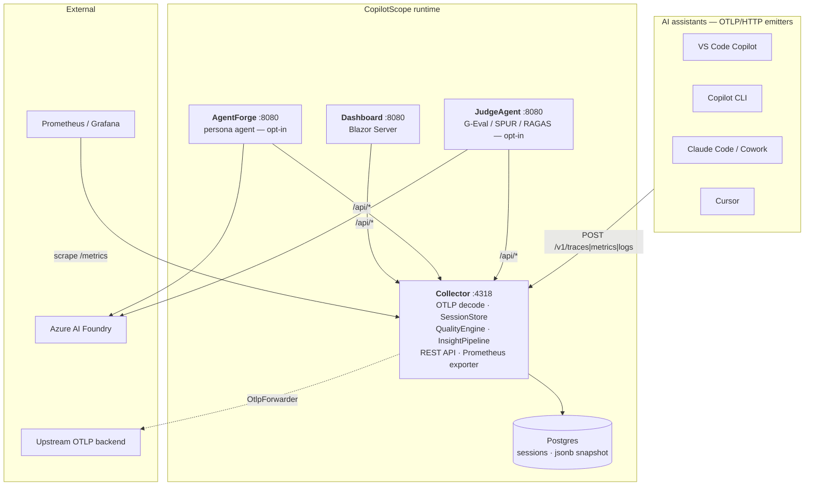

# CopilotScope — Architecture Review

> Reviewed against the working tree at `master` (merge commit `7d135c2`), August 2026.
> Companion documents: [`AureliusPromptus/docs/architecture/ARCHITECTURE_REVIEW.md`](https://github.com/konradcinkusz/AureliusPromptus/blob/master/docs/architecture/ARCHITECTURE_REVIEW.md)
> and the extracted blueprint in
> [`FSE.CORE/docs/architecture/00-REFERENCE-ARCHITECTURE.md`](https://github.com/konradcinkusz/FSE.CORE/blob/master/docs/architecture/00-REFERENCE-ARCHITECTURE.md).

---

## 1. What this system is

CopilotScope ingests OpenTelemetry from AI coding assistants (VS Code Copilot,
Copilot CLI, Claude Code, Claude Cowork, Cursor), aggregates it into sessions, and
scores each session for *quality* rather than *usage*. It is a four-process .NET 8
system orchestrated by .NET Aspire in development and shipped as independent
container images.



### Composition

| Project | Kind | Role |
|---|---|---|
| `src/CopilotScope.AppHost` | Aspire host | Dev-time composition: Postgres + pgAdmin containers, 4 projects, port pinning |
| `src/CopilotScope.Collector` | ASP.NET minimal API | Everything on the ingest path: OTLP decode, session aggregation, scoring, persistence, REST, Prometheus |
| `src/CopilotScope.Dashboard` | Blazor Server | Read-only UI over the collector's REST API |
| `src/CopilotScope.AgentForge` | ASP.NET minimal API | Opt-in persona agent grounded on consented transcripts |
| `src/CopilotScope.JudgeAgent` | ASP.NET minimal API | Opt-in cloud LLM-as-judge (G-Eval, SPUR, RAGAS, deep frustration) |
| `tools/*`, `tests/*`, `research/*` | support | Seeder, telemetry generator, xUnit suite, notebooks + LaTeX |

---

## 2. Architectural strengths

These are load-bearing decisions worth keeping and worth carrying into other repos.

**2.1 — Zero-dependency ingest.** The collector implements its own OTLP protobuf and
JSON decoders (`Otlp/ProtoReader.cs`, `OtlpDecoder.cs`, `OtlpJsonDecoder.cs`). The
entire service has exactly one NuGet dependency (`Npgsql`). That is a deliberate,
well-executed trade: no OpenTelemetry SDK version treadmill on the hot path, a tiny
attack surface, and fast cold starts. For an ingest endpoint that must accept traffic
from five different vendors' exporters, owning the decoder is the right call.

**2.2 — Dialect normalization at the edge.** `Domain/Sem.cs` and `Domain/ClaudeCode.cs`
map vendor-specific attribute namespaces (`gen_ai.*`, `github.copilot.*`,
`claude_code.*`) onto one internal session model. Everything downstream — scoring,
analyzers, UI, exporters — sees one schema. This is textbook anti-corruption layer
placement and it is why adding Cursor and Cowork cost a mapping file rather than a
refactor.

**2.3 — Analyzer plugin pipeline.** `Quality/Insights.cs` defines `IInsightAnalyzer`;
five implementations are registered in `Program.cs` and consumed through
`InsightPipeline`. A new algorithm is one class plus one DI line, with no UI work.
The cloud-only analyzers implement the same interface and register conditionally,
degrading to a `no-data` result rather than an error. This is the single best
extensibility decision in the codebase.

**2.4 — Persistence that cannot block ingest.** `PersistenceWriter` is a hosted
service that batches dirty sessions and upserts once per second; the collector
rehydrates from Postgres on startup and runs in-memory when no connection string is
present. A database outage degrades the system instead of stopping it. The optionality
is real, not aspirational — `dotnet run` on a bare machine works.

**2.5 — Documented non-goals.** `README.md` §"How *not* to use CopilotScope" and
`docs/STRATEGY.md` §4 state explicitly that the tool is not a developer scoreboard and
that acceptance rate is not a target. Encoding Goodhart's law as a design constraint —
and pairing acceptance with edit survival as a counter-metric — is a genuine
architectural property, not documentation garnish.

**2.6 — Fixed, unproxied ingest port.** The AppHost pins the collector to `4318`
with `IsProxied = false`, so client configuration (`otlpEndpoint: http://localhost:4318`)
is stable regardless of Aspire's port allocation. Small detail, correct instinct: the
externally-contracted port is not allowed to float.

---

## 3. Findings

Ordered by severity. Each states the concrete failure, not just the smell.

### 3.1 — HIGH · Container base images have crossed a major version away from the TFM

`Dockerfile`, `Dockerfile.agentforge`, `Dockerfile.dashboard` and `Dockerfile.judgeagent`
all build `FROM mcr.microsoft.com/dotnet/sdk:10.0` and run `FROM mcr.microsoft.com/dotnet/aspnet:10.0`,
while every `csproj` targets `net8.0`.

The comment block at the top of `Dockerfile` still says:

> *"The SDK is 9.0 to match CONTRIBUTING.md … Do not let a major-version bump of either
> image land without retargeting the projects first; Dependabot is configured to ignore those."*

The guard did not hold — commits `f027909` (`Bump dotnet/aspnet from 8.0 to 10.0`) and
`1d3da93` (`Bump dotnet/sdk-10.0`) landed anyway, and the comment now contradicts the
`FROM` lines directly above it. The default roll-forward policy (`Minor`) does **not**
cross a major version, so a `net8.0` application published into an `aspnet:10.0` image
fails at startup with *"The framework 'Microsoft.NETCore.App', version '8.0.0' was not found"*
unless the 8.0 shared framework happens to be present or `DOTNET_ROLL_FORWARD=Major` is set.

**Fix:** pick one direction and make it consistent — either retarget all projects to
`net10.0` (and update `ci.yml`'s SDK matrix), or pin the images back to `8.0`. Then
re-check that `.github/dependabot.yml` actually ignores the Docker major bumps it
claims to, and delete the now-false comment.

### 3.2 — HIGH · The query API is unauthenticated while ingest is not

In `src/CopilotScope.Collector/Program.cs`, the ingest key gate is applied to
`POST /v1/{signal}`, `POST /api/admin/seed` and `GET /metrics`. It is **not** applied to:

- `GET /api/sessions`
- `GET /api/sessions/{id}`
- `GET /api/overview`
- `DELETE /api/sessions/{id}`

With `captureContent` enabled, `/api/sessions/{id}` returns the stored prompt and
response transcript (bounded to 100 entries × 4 000 chars). So anyone who can reach the
collector's port can read every captured conversation and delete any session, while
being unable to *write* telemetry. That inversion is the wrong way round.

On a laptop this is defensible. In the Container Apps deployment (`infra/main.bicep`
sets `ingress.external: true`) it is not — the whole API is on the public internet
behind nothing.

**Fix:** apply the same key check to the `/api` group, or split into two keys (ingest
vs. read) so a client credential does not also grant read. `DELETE` in particular should
require a stronger credential than either.

### 3.3 — HIGH · The collector cannot be horizontally scaled, and nothing says so

`SessionStore` is registered `AddSingleton` and holds all session state in process
memory. Aggregation is stateful across OTLP batches: a session is built up from spans,
metrics and logs that arrive in separate requests. Two replicas behind a load balancer
would each see a fraction of a session's telemetry and both would produce wrong
aggregates — and both would then upsert their partial view over the other's row in
Postgres.

`infra/main.bicep` does not set `scale.minReplicas`/`maxReplicas`, so the Container App
uses the platform default and *will* scale out under load. This is a silent data-corruption
path, not a performance limit.

**Fix:** pin `minReplicas: 1, maxReplicas: 1` in the Bicep template with a comment
explaining why, and document the single-instance constraint in the README's deployment
table. If multi-instance is ever wanted, the aggregation has to move behind a partitioned
queue keyed on `gen_ai.conversation.id`.

### 3.4 — MEDIUM · Aspire SDK and package versions are three majors apart

`src/CopilotScope.AppHost/CopilotScope.AppHost.csproj`:

```xml
<Sdk Name="Aspire.AppHost.Sdk" Version="9.3.0" />
...
<PackageReference Include="Aspire.Hosting.AppHost" Version="13.4.6" />
<PackageReference Include="Aspire.Hosting.PostgreSQL" Version="13.4.6" />
```

The SDK generates the `Projects.*` type references and the manifest; the packages
provide the hosting API. Keeping them three major versions apart is not a supported
combination and makes `azd`/manifest generation unpredictable. `README.md` compounds it
by advertising "Aspire.Hosting.* 9.3" in the projects table.

**Fix:** move both to the same version and update the README table.

### 3.5 — MEDIUM · The observability product does not instrument itself

There is no `ServiceDefaults` project. No project references any `OpenTelemetry.*`
package. Consequences:

- Neither the collector nor the dashboard emits traces, metrics or logs to an OTLP
  endpoint. When ingest is slow, there is nothing to look at.
- Only the collector exposes a health endpoint (`/api/health`, hand-written). The
  AppHost does not call `WithHttpHealthCheck` on any resource, so Aspire's dashboard
  shows "running" for a process that is not serving.
- No service discovery: the Dashboard reads `services:collector:http:0` manually with
  a fallback chain (`Dashboard/Program.cs`), reimplementing what
  `AddServiceDefaults()` + `AddServiceDiscovery()` provide. AgentForge and JudgeAgent
  each carry a near-identical `CollectorClient`/`ICollectorClient` pair.
- No `AddStandardResilienceHandler` on the HTTP clients that call the collector and
  Azure AI Foundry, so a Foundry blip surfaces as an unretried 5xx.

This is the largest structural gap relative to AureliusPromptus, which has exactly this
library. See §5.

### 3.6 — MEDIUM · One API key does three jobs

`CopilotScope:Ingest:ApiKey` authorizes telemetry ingest, admin seeding, and Prometheus
scraping. The comment in `Program.cs` argues that seeding does not widen the trust
boundary because a client that can post fake OTLP can fabricate sessions anyway — that
reasoning is sound for *seed*, but it does not extend to `/metrics` (a scrape credential
handed to Prometheus is now also an ingest and seed credential) and there is no rotation
story, no per-client identity, and no way to revoke one emitter.

**Fix:** separate scrape and ingest credentials at minimum; consider per-emitter keys so
a leaked laptop key can be revoked without re-configuring every client.

### 3.7 — MEDIUM · Write amplification in the persistence path

`PersistenceWriter` upserts the *entire* session as a jsonb snapshot once per second per
dirty session. A long showcase session (30+ turns, captured content up to 100 × 4 000
chars ≈ 400 KB) is rewritten in full on every tick while it is active. A dozen concurrent
active sessions is ~5 MB/s of Postgres writes to represent a few kilobytes of change.

It is a reasonable simplification at current scale, and the 1-second debounce is the
right instinct — but it should be a stated limit rather than an accident. Options:
raise the interval for large sessions, or split the hot counters into typed columns and
snapshot the transcript only on session close.

### 3.8 — LOW · Duplicated client and options code across the agent services

`AgentForge/Clients/CollectorClient.cs` + `ICollectorClient.cs` + `Config/AzureAiOptions.cs`
and `JudgeAgent/Clients/CollectorClient.cs` + `ICollectorClient.cs` + `Config/AzureAiOptions.cs`
are parallel copies. Both Dockerfiles work around this by copying the whole
`CopilotScope.Collector` source tree into the build context purely to satisfy type
references. A shared `CopilotScope.Contracts` (DTOs) plus `CopilotScope.ServiceDefaults`
(client + options + telemetry) removes both the duplication and the awkward Docker copy.

### 3.9 — LOW · Two documented cloud stories, one of them absent from the repo

`architecture.mmd` and `README.md` describe an Azure deployment (Container Apps, Static
Web App, Key Vault, Entra ID). `infra/main.bicep` deploys only the collector — no
dashboard, no Postgres, no Key Vault, no auth. Meanwhile the sibling repo has moved to
Fly.io and CopilotScope has no Fly configuration at all.

**Fix:** either mark the Azure blocks in `architecture.mmd` as *planned* consistently
(the Bicep is genuinely partial), or bring CopilotScope onto the same Fly.io deployment
model as AureliusPromptus so the two systems share one operational runbook. The blueprint
in §5 assumes the latter.

### 3.10 — LOW · Mixed-language comments and docs

`Dockerfile`, `docker-compose.yml` and `infra/main.bicep` carry Polish comments; the
source and README are English; `docs/ANALYSIS.md` is Polish. For a repo that is
positioned publicly (MIT, GHCR, stars, a research PDF) this raises the contribution
barrier. Pick English for anything a contributor must read to build or deploy, and keep
Polish for the research artefacts where the audience is deliberately local.

---

## 4. Cross-cutting assessment

| Concern | State | Note |
|---|---|---|
| Orchestration | Aspire AppHost, 4 projects + Postgres + pgAdmin | Clean, but no health checks wired |
| Service boundaries | Collector is a modular monolith; agents are separate | Correct for the workload |
| Data | Postgres, single table, jsonb snapshot + queryable columns | Good fit; write amplification noted |
| Auth | Single shared API key, ingest-only | Read API open — §3.2 |
| Observability | Emits nothing about itself | §3.5 |
| Resilience | None on outbound HTTP | §3.5 |
| Config | `CopilotScope:*` sections, env with `__` | Consistent |
| Testing | 16 xUnit files, decoder/quality/judge/persona/persistence | Strong for the size |
| CI | `ci.yml` build+test, `build-containers.yml` GHCR matrix on tags | Solid; image/TFM skew — §3.1 |
| Deployment | Compose ×3, GHCR, partial Bicep | No Fly.io — §3.9 |
| Docs | README, TUTORIAL, ANALYSIS, STRATEGY, AGENTFORGE, JUDGE_AGENT | Unusually good |

---

## 5. Alignment actions

Ordered so that each step is independently shippable.

| # | Action | Severity | Effort |
|---|---|---|---|
| 1 | Reconcile Dockerfile base images with the TFM; fix the stale comment; verify Dependabot ignores | HIGH | S |
| 2 | Apply the ingest key to `/api/*`, or introduce a separate read key | HIGH | S |
| 3 | Pin `minReplicas`/`maxReplicas` to 1 in `infra/main.bicep`; document the single-instance constraint | HIGH | S |
| 4 | Align `Aspire.AppHost.Sdk` with `Aspire.Hosting.*` | MEDIUM | S |
| 5 | Add `CopilotScope.ServiceDefaults` (OTel, health, discovery, resilience) modelled on AureliusPromptus; call it from all four services; add `WithHttpHealthCheck` in the AppHost | MEDIUM | M |
| 6 | Extract `CopilotScope.Contracts` + a single `CollectorClient`; drop the Collector-source copy from the agent Dockerfiles | LOW | M |
| 7 | Split scrape and ingest credentials | MEDIUM | S |
| 8 | Decide the cloud target — Fly.io (aligning with AureliusPromptus) or finish the Azure Bicep — and make `architecture.mmd` match | LOW | M |
| 9 | Normalize build/deploy comments to English | LOW | S |

Items 5 and 6 are the ones that carry CopilotScope onto the shared blueprint described in
[`00-REFERENCE-ARCHITECTURE.md`](https://github.com/konradcinkusz/FSE.CORE/blob/master/docs/architecture/00-REFERENCE-ARCHITECTURE.md);
the rest are corrections to this repo on its own terms.
