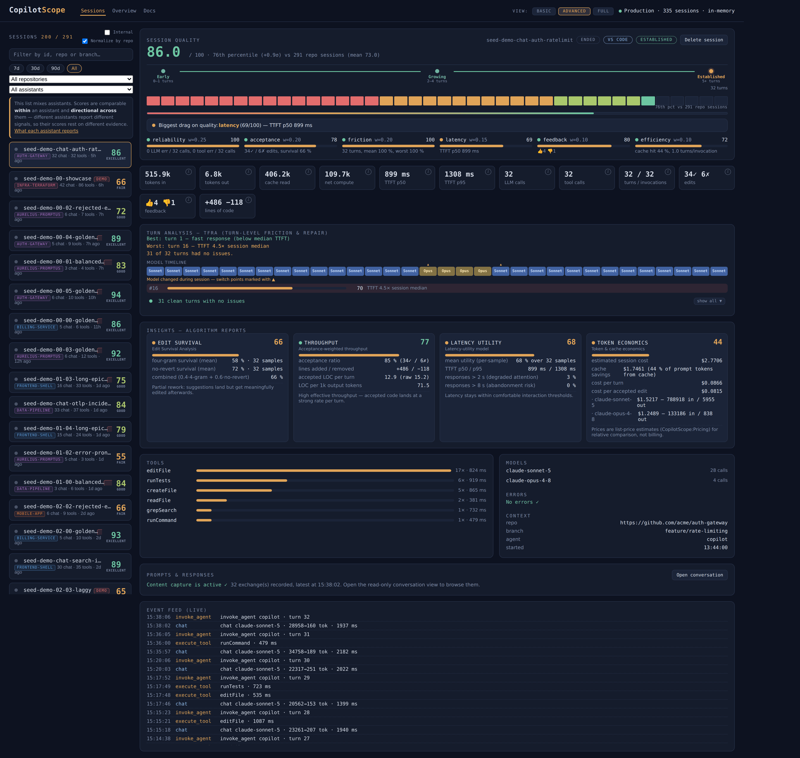

# 3. Reading a session

**Situation:** real sessions are arriving. **Result:** you can tell a bad session
from a badly-measured one, and you know which number to act on.

Everything this tutorial describes is on one page. Pick a session, switch
`View:` to **Advanced**, and you get all of it at once:

Reading that screenshot against the sections below: the score and its
percentile are at the top (step 1), the per-turn heatmap and `Turn analysis —
TFRA` give the worst turn and why (step 2), the six weighted bars are the
components (step 3), and `Edit survival` is the first of the four insight
cards (step 4).

## Read it in this order

### 1. Grade and confidence, together

Never the grade alone. Confidence is data coverage multiplied by a sample ramp,
and it is exported next to every score for a reason: **a 90 built on four
samples means less than a 70 built on forty.**

| Composite | Grade |
|---|---|
| 85+ | excellent |
| 70+ | good |
| 55+ | fair |
| 40+ | poor |
| below | critical |

### 2. The worst turn, with its reasons

This is the actionable part, and it is the thing a usage dashboard structurally
cannot give you. Every `invoke_agent` trace is one turn, scored for:

- LLM and tool errors;
- latency against **this session's own** median time to first token;
- repair loops — bursts of tool calls containing failures.

The per-session median is the point. A global latency threshold cannot tell a
slow turn from a slow model; a session compared against itself can.

### 3. The components

A composite of 62 driven by latency is a different problem from a 62 driven by
reliability, and they have different fixes.

| Component | Weight | Reading it |
|---|---|---|
| Reliability | 0.25 | Squared error-free rate. A few errors cost more than linearly |
| Acceptance | 0.20 | Always read with edit survival, never alone |
| Friction | 0.20 | The mean turn score from above |
| Latency | 0.15 | How much sat past the 2 s attention and 8 s abandonment thresholds |
| Feedback | 0.10 | Thumbs, where the assistant reports them |
| Efficiency | 0.10 | Cost per turn and per accepted edit |

**Only components with data enter the composite**, and the weights are
renormalized across them. A session missing edit and feedback telemetry is
scored on what it did produce rather than pinned near a neutral prior.

### 4. Edit survival

Acceptance without survival is the signature of code accepted and then reverted.
This is why acceptance is only 0.20 and is paired with a counter-metric: push on
acceptance alone and you reward accepting bad suggestions.

### 5. Token economics

Cost per accepted edit is the number that turns a quality conversation into a
budget conversation.

## A bad session or a badly-measured one?

This distinction is the most common misreading, and the dashboard gives you
everything needed to make it.

| Symptom | Likely reading |
|---|---|
| Low score, high confidence, a clear worst turn | A genuinely bad session. Act on the turn |
| Low score, low confidence | Not enough signal. Check what the assistant actually emits |
| Score dropped *and* confidence dropped | A changed measurement basis, not a regression — the cohort stopped reporting a signal |
| An imported session scoring oddly | Expected. It has no latency, edit-decision or feedback signal at all |

That third row is also how the alerting works: a drop that came with a
confidence drop is reported as a changed basis rather than as a regression,
because sending a team to hunt a change that never happened is how an alert
channel gets muted.

## Comparing across assistants

Carefully, or not at all. Scores are **comparable within an assistant and
directional across them**. A Claude Code session has no thumbs and, without the
tracing beta, no time-to-first-token, so its 80 rests on less evidence than a
VS Code session's 80.

For a fair bake-off, hold the signal set constant rather than just the score.
[`docs/SIGNAL_COVERAGE.md`](../SIGNAL_COVERAGE.md) has the full matrix.

## Two things the score is not

- **Not a verdict.** Read the components, not the headline.
- **Not about a person.** The score grades a session. There is no per-developer
  dimension in any view or export, and tests assert there is not.

## Where the honest limits are written down

The composite has **not** been calibrated against human labels. It is a
considered judgement, not a fitted model, and every judge score is directional
and gates nothing. [`docs/CALIBRATION.md`](../CALIBRATION.md) states the method,
and the labelling panel that would fix it is one configuration flag away.

## Next

[A team deployment](04-team-deployment.md) — which changes the security and
privacy posture entirely.
